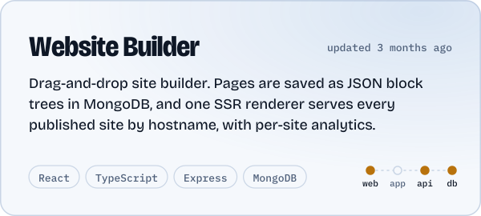
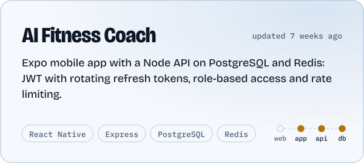
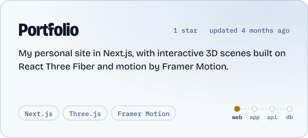
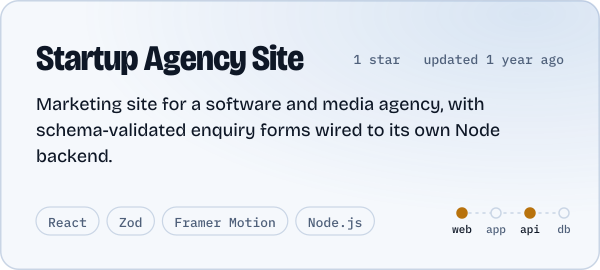

<a href="https://github.com/MukulJoshi6312">
  <picture>
    <source media="(prefers-color-scheme: dark)" srcset="./assets/hero-dark.svg"/>
    <source media="(prefers-color-scheme: light)" srcset="./assets/hero-light.svg"/>
    
  </picture>
</a>

  
  
  
  
  

## About

I like owning a feature from the button someone clicks to the row it writes in the database. Most days that means React and Next.js on the front, Express and Node in the middle, MongoDB or PostgreSQL underneath, and React Native when it needs to live in a pocket. TypeScript holds it all together.

- **Building:** SaaS products with Next.js, TypeScript and Tailwind CSS
- **Learning:** system design, DSA, and wiring AI tools into real apps
- **Open to:** full-time roles, freelance work, and open source
- **Ask me about:** React performance, API design, auth done properly

My rule: consistency beats talent when talent doesn't show up. Also, I genuinely enjoy debugging.

## Selected work

The dots on each card show which layers of the stack the project covers: web, mobile app, API and database.

<!-- CARDS:START -->
<a href="https://github.com/MukulJoshi6312/website-builder"><picture><source media="(prefers-color-scheme: dark)" srcset="./assets/cards/website-builder-dark.svg"/><source media="(prefers-color-scheme: light)" srcset="./assets/cards/website-builder-light.svg"/></picture></a>
<a href="https://github.com/MukulJoshi6312/gymApp"><picture><source media="(prefers-color-scheme: dark)" srcset="./assets/cards/gymApp-dark.svg"/><source media="(prefers-color-scheme: light)" srcset="./assets/cards/gymApp-light.svg"/></picture></a>
<a href="https://github.com/MukulJoshi6312/MukulsPortfolio"><picture><source media="(prefers-color-scheme: dark)" srcset="./assets/cards/MukulsPortfolio-dark.svg"/><source media="(prefers-color-scheme: light)" srcset="./assets/cards/MukulsPortfolio-light.svg"/></picture></a>
<a href="https://github.com/MukulJoshi6312/Startup"><picture><source media="(prefers-color-scheme: dark)" srcset="./assets/cards/Startup-dark.svg"/><source media="(prefers-color-scheme: light)" srcset="./assets/cards/Startup-light.svg"/></picture></a>

Live: [Portfolio](https://mukuls-protfolio.vercel.app), [Startup Agency Site](https://startup-kappa-three.vercel.app)
<!-- CARDS:END -->

## Recently pushed

<!-- RECENT:START -->
- [**codeauditor**](https://github.com/MukulJoshi6312/codeauditor) TypeScript · pushed 6 weeks ago · [live](https://codeauditor-nine.vercel.app)
- [**gymApp**](https://github.com/MukulJoshi6312/gymApp) TypeScript · pushed 6 weeks ago
- [**dpdp_backend**](https://github.com/MukulJoshi6312/dpdp_backend) Python · pushed 2 months ago
- [**dpdp**](https://github.com/MukulJoshi6312/dpdp) TypeScript · pushed 3 months ago
- [**website-builder**](https://github.com/MukulJoshi6312/website-builder) TypeScript · pushed 3 months ago
- [**task-frontend**](https://github.com/MukulJoshi6312/task-frontend) TypeScript · pushed 3 months ago
<!-- RECENT:END -->

Cards and this list rebuild themselves every day from my GitHub activity.

## Stack, end to end

| Layer | Tools |
| :--- | :--- |
| **Web** |  |
| **Mobile** |  React Native with Expo |
| **API** |  |
| **Data & cloud** |  |
| **Tooling** |  |

## Activity

  <picture>
    <source media="(prefers-color-scheme: dark)" srcset="./profile/stats-dark.svg"/>
    <source media="(prefers-color-scheme: light)" srcset="./profile/stats-light.svg"/>
    
  </picture>
  <picture>
    <source media="(prefers-color-scheme: dark)" srcset="./profile/top-langs-dark.svg"/>
    <source media="(prefers-color-scheme: light)" srcset="./profile/top-langs-light.svg"/>
    
  </picture>

<picture>
  <source media="(prefers-color-scheme: dark)" srcset="https://streak-stats.demolab.com?user=MukulJoshi6312&hide_border=true&border_radius=22&background=0E1726&stroke=2B3D5C&ring=F2A93B&fire=F2A93B&currStreakNum=E8EEF6&sideNums=E8EEF6&currStreakLabel=F2A93B&sideLabels=93A6C2&dates=93A6C2"/>
  <source media="(prefers-color-scheme: light)" srcset="https://streak-stats.demolab.com?user=MukulJoshi6312&hide_border=true&border_radius=22&background=F5F8FC&stroke=C9D5E5&ring=B8720C&fire=B8720C&currStreakNum=0E1726&sideNums=0E1726&currStreakLabel=B8720C&sideLabels=4F607A&dates=4F607A"/>
  
</picture>

<picture>
  <source media="(prefers-color-scheme: dark)" srcset="./profile/snake-dark.svg"/>
  <source media="(prefers-color-scheme: light)" srcset="./profile/snake-light.svg"/>
  
</picture>

 

<picture>
  <source media="(prefers-color-scheme: dark)" srcset="./assets/footer-dark.svg"/>
  <source media="(prefers-color-scheme: light)" srcset="./assets/footer-light.svg"/>
  
</picture>
