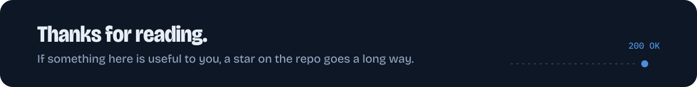

  
  
  
  

## About

I like owning a feature from the button someone clicks to the document it writes in the database. Most days that means React and Next.js on the front, Express and Node in the middle, and MongoDB underneath, with TypeScript holding it all together.

- **Building:** SaaS products with Next.js, TypeScript and Tailwind CSS
- **Learning:** system design, DSA, and wiring AI tools into real apps
- **Open to:** open source, frontend work, and freelance projects
- **Ask me about:** React performance, REST APIs, MERN architecture

My rule: consistency beats talent when talent doesn't show up. Also, I genuinely enjoy debugging.

## Stack, end to end

| Layer | Tools |
| :--- | :--- |
| **Client** |  |
| **Mobile** |  React Native |
| **API** |  |
| **Data & cloud** |  |
| **Tooling** |  |

## Selected work

<!--
  Replace these with your 3 best repos. For each one:
  1. Record a 5–10 second GIF of it working (ScreenToGif / Kap / LICEcap) and drop it in /assets.
  2. Write ONE line on the problem it solves and a real result.
  A GIF of your app running beats any badge or animation on this page.
-->

### [Project name](https://github.com/MukulJoshi6312/REPO)
One line on the problem it solves and one real result, like "cut checkout time in half" or "used by 200 students".
`Next.js` `TypeScript` `MongoDB` · [Live demo](https://example.com) · [Source](https://github.com/MukulJoshi6312/REPO)

<!--  -->

### [Project name](https://github.com/MukulJoshi6312/REPO)
One line on the problem it solves and one real result.
`React` `Node.js` `Express` · [Live demo](https://example.com) · [Source](https://github.com/MukulJoshi6312/REPO)

### [Project name](https://github.com/MukulJoshi6312/REPO)
One line on the problem it solves and one real result.
`React Native` `Firebase` · [Live demo](https://example.com) · [Source](https://github.com/MukulJoshi6312/REPO)

## Activity

  
  

 

